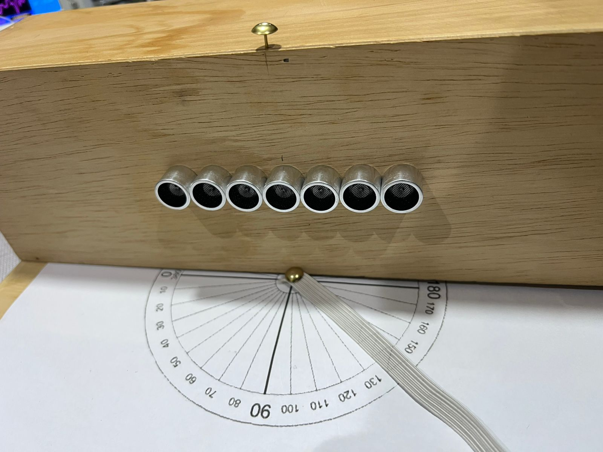

# Antenas Trabajo2

Este trabajo presenta el diseño e implementación
de un arreglo lineal uniforme conformado por siete transmisores
ultras´onicos, cada uno alimentado por una señal cuadrada de
40 kHz. Para lograr la orientación del haz de radiación, se
aplica un desfase progresivo constante entre las señales de
cada transmisor, lo que permite modificar el ángulo de máxima
radiación del arreglo. El control del desfase se realiza mediante
un potenciómetro externo, lo que permite ajustar dinámicamente
la dirección del haz. El sistema se implementa en la tarjeta FPGA
Basys 3, utilizando lógica digital en VHDL e integrando el módulo
XADC para la lectura del valor analógico del potenciómetro. Se
analiza el comportamiento teórico y experimental del arreglo
para distintas configuraciones de fase, evaluando la direcciona-
lidad del patrón de radiación mediante mediciones prácticas y
comparaciones con los modelos teóricos.

